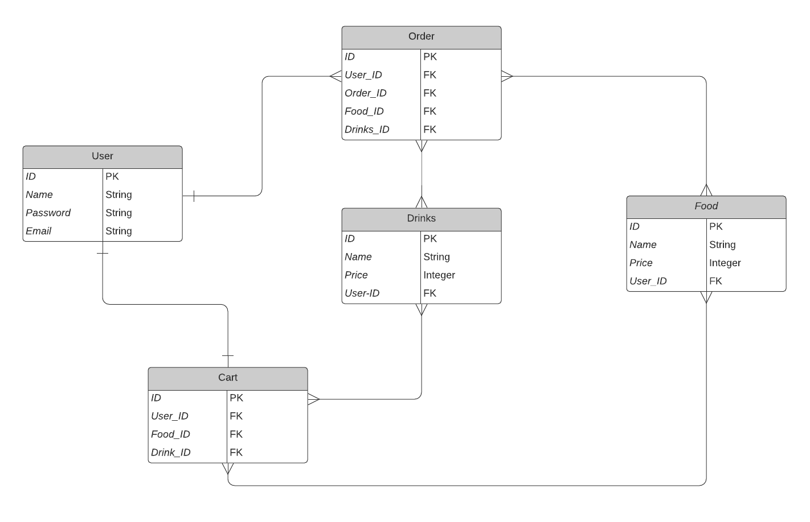

# Project-2

## **Café Java Hut**

Café Java Hut is an e-commerce website designed to make ordering your favourite café drink or baked good a breeze.

---

## **Café Java Hut**

This project was created in collaboration with:
[Zahra Abdulrashid](https://github.com/zarax7)

---

### **Screenshots**

---

### **Technologies Used**

- Javascript (Node.js)
- HTML
- CSS (Grid, Flexbox)
- PostgreSQL
- Visual Studio Code
- Chrome DevTools
- Trello
- Lucid Chart

---

### **Planning**

[Trello Board](https://trello.com/b/i0p0BKKS/cafe-java-hut)
[ERD](https://lucid.app/lucidchart/3bce58a4-37e2-41c4-8abb-6aee2465d48b/edit?invitationId=inv_003b0436-a5b6-4f53-93bd-3dfff426ffe4)

---

### **Getting Started**

https://sd3kim.github.io/futurama-man/

Users can browse through the menu page to select a hot/cold drink or fresh baked good, with options to select a size or customize the drink to your liking! The cart page will allow users to view their added items, with the option to remove if desired. When the user is all set to check out, the 'Order' button can be pressed displaying a nice "Thank You" message and showing the contents of the order.

---

### **Next Steps**

- Show total cost of order
- Quantity button (won't show repeated items but increase their quantity)
- OAUTH
